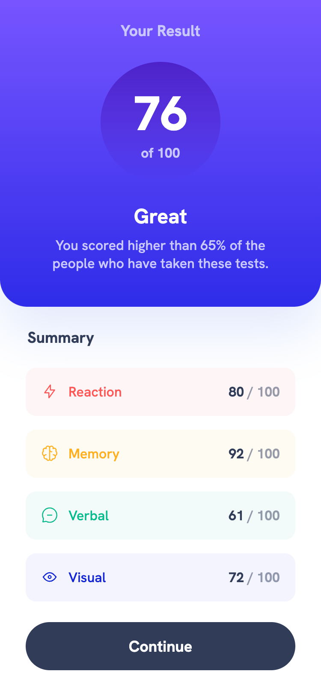

# Frontend Mentor - Results summary component solution

This is a solution to the [Results summary component challenge on Frontend Mentor](https://www.frontendmentor.io/challenges/results-summary-component-CE_K6s0maV). Frontend Mentor challenges help you improve your coding skills by building realistic projects. 

## Table of contents

- [Overview](#overview)
  - [The challenge](#the-challenge)
  - [Screenshot](#screenshot)
  - [Links](#links)
- [Author](#author)

## Overview

### The challenge

Users should be able to:

- View the optimal layout for the interface depending on their device's screen size
- See hover and focus states for all interactive elements on the page
- **Bonus**: Use the local JSON data to dynamically populate the content

### Screenshot

### Links

- Solution URL: [https://www.frontendmentor.io/solutions/results-summary-component-using-flex-mobile-first-RlwkblE4gE](https://your-solution-url.com)
- Live Site URL: [https://waquintero-ia.github.io/results-summary-component-main/](https://your-live-site-url.com)

## Author

- Frontend Mentor - [https://www.frontendmentor.io/profile/waquintero-ia](https://www.frontendmentor.io/profile/yourusername)
